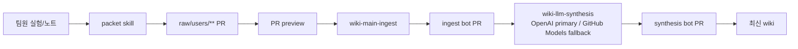

# Team LLM Wiki

ETRI/DACON 수면 건강 해커톤 팀의 공유 지식 저장소입니다.

팀원은 `wiki/`를 직접 고치지 않고, 자신의 실험 결과를 `raw/users/**` packet PR로 올립니다. 이후 GitHub Actions가 검증하고 LLM synthesis가 팀 wiki로 정리합니다.

## 흐름



| 단계 | 역할 |
| --- | --- |
| Packet PR | 팀원이 raw evidence와 claim boundary 제출 |
| Ingest bot PR | packet을 deterministic하게 검증/정규화 |
| Synthesis bot PR | LLM이 기존 wiki와 통합 |

## Canonical Wiki Structure

Durable wiki pages live in these namespaces:

```text
wiki/preprocessing
wiki/features
wiki/models
wiki/performance
wiki/claims
wiki/targets
wiki/decisions
wiki/reports
wiki/team
```

Deprecated namespaces such as `wiki/datasets`, `wiki/benchmarks`, `wiki/questions`, `wiki/submissions`, `wiki/experiments`, and `wiki/sources` are compatibility-only. New packet PRs and bot outputs must not create substantive pages there.

## 팀원이 할 일

1. packet skill을 설치합니다.
2. skill 인터뷰로 실험/모델/feature/성능을 packet화합니다.
3. `raw/users/<owner>/<category>/<date-slug>/`만 수정하는 PR을 올립니다.
4. preview comment에서 위험도, 누락 증거, 영향을 받을 wiki page를 확인합니다.
5. merge 후 생성되는 ingest/synthesis bot PR을 리뷰합니다.

Packet skill:

```text
https://github.com/chunryongoh/team-llm-wiki-packet-skill
```

```bash
git clone https://github.com/chunryongoh/team-llm-wiki-packet-skill.git
team-llm-wiki-packet-skill/install.sh --verify
```

## LLM synthesis 모델 경로

`wiki-llm-synthesis`는 GitHub Actions 안에서 끝까지 돌아가야 합니다.

- 1순위: `OPENAI_API_KEY`가 있으면 OpenAI Responses API `gpt-5.5`를 사용합니다.
- `gpt-5.5` primary가 가능하면 먼저 `entity-graph`, `evidence-claims`, `wiki-routing` specialist lane을 각각 실행하고, 마지막 `gpt-5.5` integrator가 lane 결과를 합쳐 wiki page를 작성합니다.
- fallback: OpenAI key가 없거나 quota/rate/server 계열 recoverable 오류가 나면 GitHub Models를 `GITHUB_TOKEN`으로 호출합니다.
- 기본 GitHub Models fallback은 `openai/gpt-4.1`입니다. 더 좋은 모델을 허용한 repo/org에서는 Actions variable `GITHUB_MODELS_MODEL`로 바꿀 수 있습니다.
- synthesis bot PR 본문에는 실제 사용된 모델과 specialist lane 요약이 표시됩니다.

## AI가 먼저 읽을 파일

팀원이 Codex, Claude, Cursor 등을 사용할 때는 최신 `main`을 받은 뒤 아래 순서로 읽게 합니다.

```text
AGENTS.md
wiki/latest-context.md
wiki/index.md
관련 wiki page
필요 시 raw evidence 또는 automation/.cache/compiled/*.json
```

예시:

```bash
git clone https://github.com/chunryongoh/team_llm_wiki.git .team_context/team_llm_wiki
git -C .team_context/team_llm_wiki pull --ff-only
```

```text
.team_context/team_llm_wiki/AGENTS.md,
wiki/latest-context.md, wiki/index.md를 먼저 읽고
최신 팀 맥락을 반영해줘.
```

## 핵심 규칙

- `raw/`는 원천 증거입니다. 임의 수정하지 않습니다.
- `wiki/`는 팀이 읽는 지식층입니다. packet 복붙이 아니라 stable entity 중심으로 정리합니다.
- local OOF, notebook output, DACON public LB, private LB, official validation은 서로 다른 근거입니다.
- public LB 기록은 제출 파일/hash, private score, 팀 재현 근거가 없으면 보통 `tentative`입니다.
- 중요한 판단은 chat에만 남기지 말고 wiki로 되돌립니다.
- 오래된 tentative claim은 [Stale Tentative Claims](wiki/claims/stale-tentative-claims.md)에서 닫힘 조건과 함께 추적합니다.

## 주요 경로

```text
raw/users/**                  팀원이 올리는 packet
wiki/latest-context.md         최신 팀 맥락
wiki/index.md                  wiki 목차
wiki/team/                     운영 정책
automation/.cache/compiled/    packet별 정규화 JSON
raw/results/wiki-ingest/       ingest report
raw/results/llm-synthesis/     synthesis report
```

상세 문서:

- [LLM Wiki Operating Harness](wiki/team/llm-wiki-operating-harness.md)
- [Page Taxonomy](wiki/team/page-taxonomy.md)
- [Contribution Workflow](wiki/team/contribution-workflow.md)

## 검증

```bash
PYTHONPATH=src python -m team_llm_wiki.cli check-wiki-health --repo-root .
PYTHONDONTWRITEBYTECODE=1 PYTHONPATH=src pytest -q
```

PR/ingest/synthesis 검증은 strict입니다. 단, [Stale Tentative Claims](wiki/claims/stale-tentative-claims.md)에 등록된 오래된 tentative claim은 warning으로 관리하고, 등록되지 않은 stale claim은 error로 막습니다. scheduled `wiki-health-check`는 모든 stale tentative claim을 warning으로 내려 daily/weekly brief를 계속 생성합니다.

최근 검증 사례: DACON `Public 0.5917 LGBM+XGB anchor` packet PR `#47` -> ingest PR `#48` -> synthesis PR `#49`.
