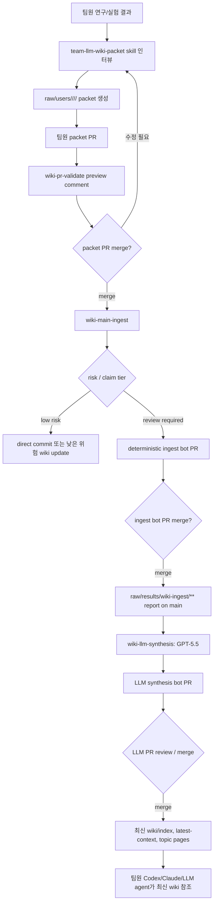
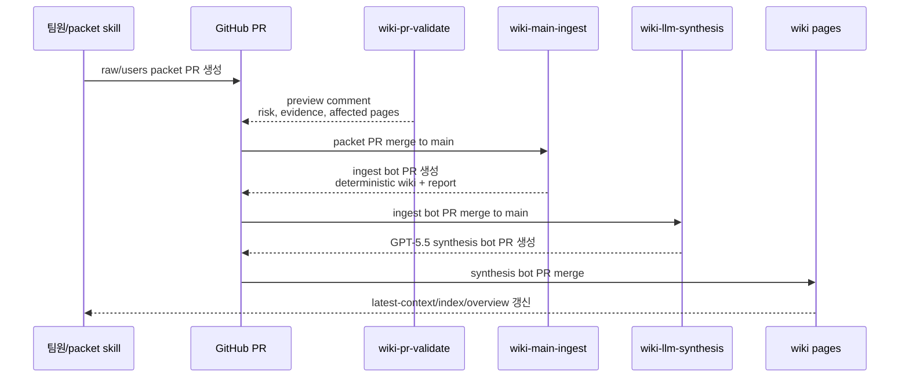

# Team LLM Wiki

GitHub repo를 팀 실험 지식 저장소로 쓰기 위한 LLM wiki 자동 ingest 도구입니다.

팀원이 `raw/users/<owner>/<category>/<date-slug>/` 아래에 실험, 모델, feature, 성능, 회의 자료를 packet 형태로 올리면 GitHub Actions가 이를 검증하고 `wiki/`에 요약 페이지, 인덱스, 로그, 최신 컨텍스트, brief를 생성합니다.

이 repo는 팀원이 직접 wiki를 손으로 편집하는 방식이 아니라, **raw packet PR -> deterministic ingest PR -> GPT-5.5 synthesis PR** 순서로 팀 지식을 축적합니다.

## 한눈에 보는 운영 흐름



### PR은 왜 여러 개 생기나?

| PR 종류 | 누가 만드나 | 주요 변경 | 팀원이 보는 것 |
| --- | --- | --- | --- |
| Packet PR | 팀원 또는 packet skill | `raw/users/**` source packet | 원천 evidence, claim boundary, metric contract |
| Ingest bot PR | `wiki-main-ingest` | deterministic wiki page, compiled JSON, ingest report | raw 기반 1차 정리와 guard 결과 |
| LLM synthesis bot PR | `wiki-llm-synthesis` + `gpt-5.5` | topic page, decision, question, report, overview 갱신 | 고차원 통합 정리와 review-required claim register |

팀 배포 전에는 오래된 bot PR, 실험용 PR, 최신 main과 겹치는 synthesis PR을 닫아 PR 목록을 비워둡니다. 최신 지식은 `main`의 `wiki/latest-context.md`와 `wiki/index.md`에서 시작합니다.

## Packet Skill과의 관계

Packet skill은 이 repo 안에 들어있는 기능이 아니라, 팀원이 자기 AI 도구에 설치해서 사용하는 **별도 contributor-side skill**입니다.

- Skill repo: [chunryongoh/team-llm-wiki-packet-skill](https://github.com/chunryongoh/team-llm-wiki-packet-skill)
- 역할: ML/DL 전문가 인터뷰 형식으로 packet 내용을 묻고, `manifest.yaml`, `packet.md`, `performance.yaml`, `metrics.json` 같은 raw evidence contract를 만든 뒤 PR-first 방식으로 이 repo의 `raw/users/**`에 올립니다.
- 경계: skill은 wiki를 직접 고치지 않습니다. wiki 생성과 synthesis는 이 repo의 GitHub Actions가 담당합니다.

설치 예시:

```bash
git clone https://github.com/chunryongoh/team-llm-wiki-packet-skill.git
python team-llm-wiki-packet-skill/scripts/install_local.py --target both
```

Codex 또는 Claude에서는 repo 링크를 주고 “이 skill을 설치하고 team_llm_wiki repo에 packet PR을 만들어 달라”고 요청하면 됩니다.

```text
https://github.com/chunryongoh/team-llm-wiki-packet-skill
```

Skill 사용 후 정상 PR은 보통 다음 형태만 변경합니다.

```text
raw/users/<owner>/<category>/<date-slug>/
  manifest.yaml
  packet.md
  <packet-specific>.yaml
  <metrics-or-evidence>.json
```

`wiki-pr-validate`가 PR comment로 packet skill compatibility, risk tier, claim status, 누락 evidence, merge 후 생성될 wiki page를 보여줍니다.

## 핵심 구조

```text
raw/users/<owner>/<category>/<date-slug>/ # 사람이 올리는 원천 증거
wiki/                                      # 자동 생성/검토되는 팀 지식
automation/.cache/compiled/                # packet별 정규화 JSON
raw/shared/templates/wiki-packet/          # packet 작성 템플릿
```

- `raw/`는 source-of-truth입니다. 원천 파일은 packet 안에 두고, 자동화는 이를 증거로만 읽습니다.
- `wiki/`는 팀이 읽는 memory layer입니다. ingest가 packet을 요약해 페이지, 인덱스, 로그, 최신 컨텍스트를 갱신합니다.
- `automation/.cache/compiled/<packet-id>.json`은 LLM/agent가 안정적으로 읽을 수 있는 정규화 결과입니다.

## 설치

```bash
python -m pip install -e .[test]
```

CLI는 둘 중 편한 방식으로 실행할 수 있습니다.

```bash
team-llm-wiki --help
PYTHONPATH=src python -m team_llm_wiki.cli --help
```

## 빠른 사용법

직접 수동으로 packet을 만들 수도 있지만, 팀원에게는 packet skill 사용을 권장합니다. 수동 작성이 필요한 경우에는 아래 절차를 따릅니다.

1. 템플릿을 복사해 packet을 만듭니다.

```bash
mkdir -p raw/users/alice/performance/2026-06-01-example-packet
cp raw/shared/templates/wiki-packet/manifest.yaml raw/users/alice/performance/2026-06-01-example-packet/manifest.yaml
```

2. `manifest.yaml`과 `raw_paths`가 가리키는 packet-local 파일을 채웁니다.

```text
raw/users/alice/performance/2026-06-01-example-packet/
  manifest.yaml
  performance.yaml
  result.json
  folds.csv
```

3. ingest 계획을 먼저 확인합니다.

```bash
PYTHONPATH=src python -m team_llm_wiki.cli plan-wiki-main-ingest \
  --repo-root . \
  --changed-path raw/users/alice/performance/2026-06-01-example-packet/manifest.yaml
```

4. 실제 wiki 생성을 실행합니다.

```bash
PYTHONPATH=src python -m team_llm_wiki.cli run-wiki-main-ingest \
  --repo-root . \
  --changed-path raw/users/alice/performance/2026-06-01-example-packet/manifest.yaml \
  --run-id local-run
```

5. 전체 wiki 상태를 점검합니다.

```bash
PYTHONPATH=src python -m team_llm_wiki.cli check-wiki-health --repo-root .
```

6. review-required wiki page를 GPT-5.5로 한 번 더 합성합니다.

```bash
OPENAI_API_KEY=... PYTHONPATH=src python -m team_llm_wiki.cli run-llm-wiki-synthesis \
  --repo-root . \
  --changed-path raw/users/alice/performance/2026-06-01-example-packet/manifest.yaml \
  --run-id local-llm-run
```

LLM synthesis는 `AGENTS.md`, `CLAUDE.md`, `wiki/latest-context.md`, packet manifest, packet-specific YAML, `packet.md`, 기존 wiki page를 모두 prompt context에 넣고 OpenAI Responses API의 `gpt-5.5`를 호출합니다. 결과는 `wiki/` page만 수정할 수 있으며 항상 review-required bot PR 대상으로 취급합니다.

## Packet 작성 규칙

새 packet은 `packet_type`을 사용합니다. 기존 호환성을 위해 legacy `type`도 읽지만 새 문서에는 `packet_type`을 권장합니다.

필수 manifest 필드:

- `id`: ASCII kebab-case, 최대 120자
- `packet_type`: `reference`, `meeting`, `experiment`, `feature`, `model`, `performance`, `preprocessing`, `augmentation`
- `title`, `date`, `owner`, `task`, `summary`
- `status`: `submitted`, `validated`, `ingested`, `rejected`, `superseded`
- `claim_status`: `tentative`, `supported`, `disputed`, `superseded`
- `dataset`, `split`, `model`
- `claim_boundary`
- `raw_paths`
- `intended_wiki_targets`

Packet별 추가 YAML:

- `preprocessing`: split, leakage guard, normalization, imputation, feature window 정책
- `feature`: feature family, source modality, formula, `leakage_risk`
- `model`: objective, hyperparameters, training/validation 전략, `weights_policy`
- `performance`: metric 정의, overall/target metrics, OOF/submission prediction, uncertainty, claim status
- `augmentation`: 생성 방식, privacy guard, label policy, validation policy

`raw_paths`가 packet-specific YAML을 가리키면 해당 파일도 packet root 안에 실제로 있어야 합니다.

## 주요 정책

### 1. Raw 증거 우선

- `raw_paths`는 packet root 밖으로 나갈 수 없습니다.
- metric 검증은 manifest 숫자를 믿지 않고 YAML/JSON raw evidence에서 `metric_key`로 다시 읽습니다.
- `split.group_key`와 `split.fold_file`이 있으면 train/validation group overlap을 검사합니다.

### 2. 보안/개인정보 차단

다음은 hard fail입니다.

- secret-like content
- PII-like content
- `.env`, private key, credential 파일명
- model weight 파일: `.bin`, `.pt`, `.pth`, `.ckpt`, `.onnx`, `.safetensors`, `.pkl`

### 3. Review 정책

자동화 결과에는 두 개의 분리된 상태가 있습니다.

- `publish_action`: 자동화가 무엇을 할지 나타냅니다. `direct_commit`, `bot_pr`, `hard_fail`
- `risk_tier`: 의미상 위험도를 나타냅니다. `tier0-catalog`부터 `tier4-governance`

기본 동작:

- `reference`, `meeting`: guard 통과 시 direct commit 가능
- `feature`, `model`, `performance`, `experiment`, `preprocessing`, `augmentation`: review가 필요한 bot PR
- `supported`, `disputed`, `superseded` claim: governance-tier로 bot PR 필요
- guard 실패, policy conflict, link lint 실패: hard fail 및 `tier4-governance`

### 4. Bot loop 방지

Bot commit/PR은 다음 prefix를 사용합니다.

- direct commit: `[wiki-bot] ingest wiki packets`
- review PR: `[wiki-bot][review-required] ingest wiki packets`

`wiki-main-ingest`는 이 prefix를 감지해 ingest loop를 피합니다. 기본 `GITHUB_TOKEN`으로 생성한 bot commit은 GitHub 정책상 후속 workflow를 트리거하지 않을 수 있습니다. bot 출력으로도 후속 workflow가 반드시 돌아야 하면 PAT 또는 GitHub App token을 써야 합니다.

## GitHub Actions

| Workflow | Trigger | 역할 |
| --- | --- | --- |
| `tests` | `push` to `main`, PR, manual | 전체 pytest 실행 |
| `wiki-main-ingest` | `main`의 `raw/users/**`, policy/schema 변경, manual | packet ingest 후 direct commit 또는 bot PR 생성 |
| `wiki-llm-synthesis` | `raw/results/wiki-ingest/**`가 main에 merge된 뒤, manual | `gpt-5.5`로 고차원 wiki synthesis를 작성하고 review-required bot PR 생성 |
| `wiki-pr-validate` | PR의 packet/policy/schema 변경 | canonical wiki를 쓰지 않고 preview comment 작성 |
| `wiki-health-check` | schedule, manual | wiki health, daily/weekly brief, stale-claim report 생성 |

PR이 없으면 `wiki-pr-validate` run history가 비어 있는 것이 정상입니다.

### Merge 순서



`wiki-llm-synthesis`를 자동 실행하려면 repo secret `OPENAI_API_KEY`가 필요합니다. secret이 없으면 workflow는 skip summary만 남기고 성공 종료합니다. 이 workflow는 deterministic ingest 결과인 `raw/results/wiki-ingest/**/report.json`에서 packet roots를 다시 찾아 읽기 때문에, raw packet merge 직후가 아니라 ingest bot PR이 merge된 뒤 고차원 합성을 수행합니다.

Packet PR preview는 packet skill과 맞는지 별도로 표시합니다. `packet_skill_compatibility`는 `pass`, `warning`, `fail` 중 하나이며, `raw/users/<owner>/<category>/<date-slug>/` 형태, `packet.md`, `claim_boundary`, metric evidence 같은 항목을 확인합니다. 첫 버전은 adoption을 막지 않도록 warning-first로 운영합니다.

Bot PR은 GitHub가 후속 checks를 자동으로 붙이지 않는 경우를 대비해 생성 전에 self-validation을 수행합니다. `wiki-main-ingest`와 `wiki-llm-synthesis`는 bot PR 또는 direct commit을 만들기 전에 `check-wiki-health`와 targeted pytest를 실행하고, bot PR 본문에 `자동 검증 결과`를 남깁니다.

GPT-5.5 synthesis의 `open_questions`는 단순 문장이 아니라 backlog item입니다. 각 질문은 `id`, `question`, `priority`, `owner_role`, `merge_blocker`, `needed_evidence`, `close_condition`을 가져야 하며, 팀원이 무엇을 확인하면 닫을 수 있는지까지 기록합니다.

## 유지보수 명령

PR preview를 로컬에서 확인:

```bash
PYTHONPATH=src python -m team_llm_wiki.cli preview-wiki-ingest \
  --repo-root . \
  --changed-path-file changed-paths.txt
```

Daily brief 생성:

```bash
PYTHONPATH=src python -m team_llm_wiki.cli generate-wiki-brief \
  --repo-root . \
  --date "$(date -u +%F)"
```

Weekly brief와 stale claim report 생성:

```bash
PYTHONPATH=src python -m team_llm_wiki.cli generate-wiki-weekly-brief \
  --repo-root . \
  --date "$(date -u +%F)"
```

GPT-5.5 synthesis를 수동 실행:

```bash
PYTHONPATH=src python -m team_llm_wiki.cli run-llm-wiki-synthesis \
  --repo-root . \
  --changed-path-file changed-paths.txt \
  --model gpt-5.5 \
  --reasoning-effort high
```

Brief 출력:

- daily: `wiki/briefs/<date>-daily.md`
- weekly: `wiki/briefs/<date>-weekly.md`
- stale claims: `wiki/briefs/<date>-stale-claims.md`
- latest pointer: `wiki/briefs/latest.md`

## 권장 운영 흐름

1. 팀원은 packet skill 인터뷰로 packet을 만들고 `raw/users/<owner>/<category>/<date-slug>/`만 수정하는 PR을 올립니다.
2. PR에서는 `wiki-pr-validate`가 preview comment로 위험도, 누락 증거, claim status, 영향을 받는 wiki page를 보여줍니다.
3. packet PR을 merge하면 `wiki-main-ingest`가 packet을 compile하고 deterministic wiki bot PR을 만듭니다.
4. ingest bot PR을 리뷰/merge하면 `wiki-llm-synthesis`가 `gpt-5.5`로 고차원 topic/decision/question/report page를 작성하는 bot PR을 만듭니다.
5. synthesis bot PR을 리뷰/merge하면 `wiki/latest-context.md`, `wiki/index.md`, `wiki/overview.md`가 최신 팀 맥락의 entrypoint가 됩니다.
6. agent나 LLM은 `wiki/latest-context.md`, `wiki/index.md`, compiled JSON을 읽어 최신 팀 맥락을 가져갑니다.

배포 전 PR hygiene:

- open PR 목록은 비워두거나, 현재 리뷰할 PR만 남깁니다.
- 오래된 bot synthesis PR은 최신 main과 충돌하거나 겹치면 닫고, 필요한 경우 최신 main에서 새로 생성합니다.
- 실험용 auth/runner PR은 운영 경로가 확정되면 닫아 팀원이 어느 workflow를 따라야 하는지 헷갈리지 않게 합니다.

## 로컬 검증

```bash
PYTHONDONTWRITEBYTECODE=1 PYTHONPATH=src pytest -q
PYTHONDONTWRITEBYTECODE=1 PYTHONPATH=src python -m team_llm_wiki.cli check-wiki-health --repo-root .
PYTHONDONTWRITEBYTECODE=1 python -m pip install --dry-run .[test]
```
