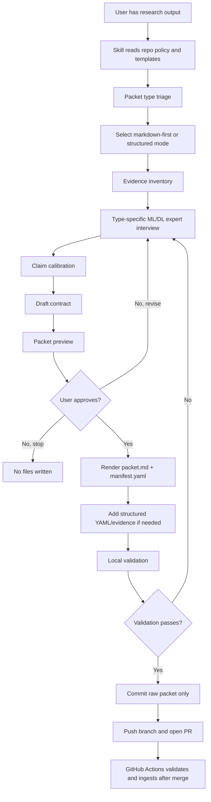

# Team LLM Wiki Packet Skill Design

Date: 2026-05-28
Status: approved-for-planning
Scope: design spec

## Summary

Create a reusable AI skill named `team-llm-wiki-packet` that helps teammates turn machine learning and deep learning work into GitHub-uploaded raw wiki packets. The skill does not act as a passive form filler. It acts as an ML/DL research interviewer: it reads the repo policy, asks expert questions, calibrates claims, previews the packet, gets explicit approval, then creates and uploads a raw packet to the GitHub repository.

The default user-facing packet is markdown-first: `packet.md` plus a helper-generated minimal `manifest.yaml` so the existing manifest-based ingest pipeline can discover it. Structured packets add type-specific YAML and raw evidence only when the work contains performance, experiment, or strong claims that need validation.

The skill's terminal outcome is a GitHub pull request containing the approved packet under `raw/users/...`. The skill must not directly edit generated wiki synthesis pages. Wiki updates remain the responsibility of the existing GitHub Actions ingest workflows.

## Goals

- Provide one consistent workflow that teammates can use from Codex, Claude Code, Cursor, ChatGPT, or another AI coding assistant.
- Convert diverse research outputs into a standard `raw/` packet format without forcing teammates to manually understand every schema detail.
- Make the default writing surface `packet.md`, while preserving compatibility with the current `manifest.yaml` ingest system.
- Escalate to structured YAML and raw metric evidence only for packet types or claim strengths that require it.
- Use an interview flow inspired by `superpowers:brainstorming` and `gstack-office-hours`: one decision at a time, explicit options, expert challenge, preview, and approval gate.
- Keep packet creation evidence-backed: raw files, metrics, split definitions, logs, model notes, and claim boundaries must be explicit.
- End by opening a GitHub pull request for the approved raw packet.

## Non-Goals

- Do not build team-member personality profiles in v1.
- Do not automatically write or rewrite `wiki/` synthesis pages.
- Do not train models, run experiments, tune hyperparameters, or fabricate results.
- Do not infer supported performance claims when raw evidence is missing.
- Do not store model weights, secrets, private keys, credential files, or PII-like artifacts.
- Do not create a full CLI wizard in v1. The skill can later delegate deterministic steps to a CLI, but the first design target is an AI-guided skill.
- Do not require every lightweight note, meeting, or reference packet to become a full structured YAML packet.
- Do not implement the skill inside the `team_llm_wiki` repository. The repository is the packet target, not the skill host.

## Packaging Boundary

`team-llm-wiki-packet` must be a standalone skill package. It should live in a skill installation location or separate skill repository, for example:

```text
~/.codex/skills/team-llm-wiki-packet/
```

The `team_llm_wiki` repository remains the target repository that the skill reads from and writes packets into. The skill may read that repo's `AGENTS.md`, `CLAUDE.md`, `wiki/`, templates, and CLI, but v1 should not add skill implementation files under `team_llm_wiki`.

Helper scripts belong inside the skill bundle:

```text
team-llm-wiki-packet/
  SKILL.md
  scripts/
  references/
  agents/
```

This keeps the workflow portable across teammates and AI tools. A teammate installs or shares the skill once, then points it at the active wiki repo.

## Skill Name and Trigger

Recommended skill name:

```yaml
name: team-llm-wiki-packet
description: >
  Use when a teammate wants to turn ML/DL work, experiment results, features,
  preprocessing notes, model configuration, performance metrics, meeting notes,
  or references into a validated Team LLM Wiki raw packet and upload it to GitHub.
  The skill interviews the user as an ML/DL research expert, creates a
  markdown-first packet with explicit approval, validates locally, commits only
  the approved raw packet, and opens a pull request.
```

Typical user triggers:

- "이 실험 결과 packet으로 올려줘"
- "내 notebook 결과를 wiki packet으로 만들어줘"
- "성능 결과를 raw에 올려줘"
- "feature engineering 내용을 팀 wiki에 올릴 packet으로 정리해줘"
- "회의 내용 packet화해서 repo에 올려줘"

## Operating Principles

### Expert Interview, Not Form Filling

The skill must not silently guess important research details. It should ask concise expert questions when a field affects validity, reproducibility, leakage risk, or claim strength.

The skill may draft obvious low-risk fields, but must call out assumptions before approval.

### One Decision at a Time

Use the interaction style of `superpowers:brainstorming`:

- Ask one high-signal question at a time.
- Prefer multiple-choice answers when the options are known.
- Let the user answer free-form when the evidence is messy.
- Summarize decisions before moving to packet creation.

### Challenge Weak Claims

Use the forcefulness of `gstack-office-hours`:

- If the user says "best model", ask what benchmark, split, baseline, and metric support it.
- If the metric is not raw-verifiable, mark the claim `tentative`.
- If split leakage cannot be ruled out, make that risk explicit.
- If public leaderboard and OOF results conflict, preserve both and avoid unsupported conclusions.

### Approval Gate

The skill must show a preview before writing or uploading packet files:

- Target packet path
- Packet type
- Files to create or copy
- `manifest.yaml` summary
- Type-specific YAML summary
- Claim status and claim boundary
- Evidence gaps and risks
- Commands that will be run

The skill proceeds only after explicit user approval.

### Markdown-First, Structured When Needed

The skill should default to a lightweight markdown packet:

```text
raw/users/<owner>/<packet-type>/<yyyy-mm-dd>-<short-slug>/
  packet.md
  manifest.yaml
```

The human-facing artifact is `packet.md`. The machine-facing `manifest.yaml` is still created because the current ingest automation discovers packets through `manifest.yaml`.

Structured evidence is added only when the selected packet type or claim strength requires it:

```text
raw/users/<owner>/<packet-type>/<yyyy-mm-dd>-<short-slug>/
  packet.md
  manifest.yaml
  performance.yaml
  metrics.json
  folds.csv
```

Default markdown packets should use cautious claim boundaries and `tentative` claim status unless the user provides verifiable evidence.

### Raw Upload Is the End State

After approval, the skill creates the packet under `raw/users/...`, validates it locally, commits only the approved packet files, pushes a packet branch, and opens a GitHub pull request.

The skill does not directly commit generated `wiki/` changes.

## Packet Path Convention

Recommended v1 path:

```text
raw/users/<owner>/<packet-type>/<yyyy-mm-dd>-<short-slug>/
```

Examples:

```text
raw/users/minji/performance/2026-05-28-lgb-cb-seed-ensemble/
raw/users/jaewon/features/2026-05-28-shap-top20-target-wise/
raw/users/hyeri/preprocessing/2026-05-28-grouped-split-v3/
raw/users/chunoh/meetings/2026-05-28-packet-skill-design/
```

Compatibility note: the current README describes `raw/users/<user>/<packet-id>/`. The typed path is a compatible refinement because the packet root is still determined by the `manifest.yaml` location.

## Packet Modes

### Mode 1: Markdown-First Packet

Use this mode for meeting notes, references, exploratory ideas, early feature hypotheses, lightweight model notes, and low-risk research handoffs.

Files:

```text
packet.md
manifest.yaml
```

`packet.md` must include minimal frontmatter:

```yaml
---
packet_type: meeting
owner: chunoh
date: 2026-05-28
claim_status: tentative
summary: "회의 결과를 packet skill 설계로 정리"
---
```

The helper script creates a manifest that is minimal from the user's perspective but complete enough for the current ingest schema. It should use safe defaults such as `split.name: none`, `model.family: not-applicable`, and `raw_paths.notes: packet.md` when the packet is not experiment/model/performance evidence.

### Mode 2: Structured Packet

Use this mode for performance packets, experiment packets, `supported` claims, metric comparisons, split-sensitive claims, or any packet that should be machine-verified.

Files:

```text
packet.md
manifest.yaml
<type-specific>.yaml
<raw evidence files>
```

Structured packet rendering starts from an intermediate draft contract created during the interview. The deterministic renderer converts that draft into schema-valid packet files.

### Future Mode: Promote Markdown to Structured

Promoting an existing markdown-first packet into a structured packet is useful but deferred from v1. It should be tracked as follow-up work rather than included in this skill release.

## Workflow

### Phase 0: Repo Context Read

The skill starts by reading:

- `AGENTS.md`
- `CLAUDE.md` when present
- `wiki/latest-context.md` when present
- `wiki/index.md`
- `wiki/team/wiki-ingest-policy.md`
- `wiki/team/contribution-workflow.md`
- `raw/shared/templates/wiki-packet/README.md`
- `raw/shared/templates/wiki-packet/manifest.yaml`
- The type-specific template for the selected packet type

If the repo is missing required policy or template files, the skill stops and explains the missing files.

### Phase 1: Packet Triage

Ask what kind of work is being packaged.

Recommended first question:

```text
어떤 종류의 packet으로 만들까요?

A. performance - metric, leaderboard, OOF, confusion matrix, baseline comparison
B. experiment - one run with dataset, split, model, feature set, logs, interpretation
C. feature - feature family, formula, leakage risk, hypothesis, evidence
D. model - architecture, objective, validation strategy, hyperparameters, inference contract
E. preprocessing - split, normalization, imputation, leakage guard, row identity
F. augmentation - synthetic data, SMOTE, LLM generation, validation policy
G. meeting/reference - meeting note, paper, blog, external source, decision evidence
```

If the user's material spans multiple packet types, the skill recommends either:

- one primary packet plus supporting evidence files, or
- multiple packets with clear ordering.

It should avoid making one oversized packet that mixes unrelated claims.

The triage result also selects a packet mode:

- Markdown-first is the default for meeting, reference, exploratory feature, and early model notes.
- Structured is required for performance, experiment, supported/disputed/superseded claims, metric comparisons, and split-sensitive claims.
- When uncertain, choose markdown-first with `claim_status: tentative`.

### Phase 2: Evidence Inventory

Ask what files or artifacts exist.

Evidence categories:

- Notebook or script
- Training log
- Evaluation log
- Metric YAML/JSON
- OOF predictions
- Submission predictions
- Fold/split CSV
- Feature list
- SHAP or interpretation artifact
- Model config
- Meeting note
- External reference
- Plot or figure

The skill should prefer packet-local copies or generated summaries over links to unstable local paths. For markdown-first packets, raw evidence can be summarized inside `packet.md` if the source file is too large or inappropriate to commit. For structured packets, evidence required for validation must be packet-local and referenced from `manifest.yaml` or type-specific YAML.

### Phase 3: Type-Specific Expert Interview

The skill asks only the questions needed for the selected type. It should not dump every schema field at once.

#### Performance Packet

Required interview topics:

- Primary metric and why it matters
- Split name and leakage risk
- Baseline result
- New result
- Overall metrics
- Target-level metrics when available
- Confusion matrix availability
- OOF prediction availability
- Submission prediction availability
- Uncertainty or seed variance
- Raw metric evidence path
- Claim status: `tentative`, `supported`, `disputed`, `superseded`

Expert challenge prompts:

- "이 metric은 raw YAML/JSON에서 재검증 가능한가요?"
- "baseline과 동일 split인가요?"
- "target별로 성능이 악화된 항목이 있나요?"
- "public LB 결과인지, OOF 결과인지, local validation인지 구분해야 합니다."

#### Experiment Packet

Required interview topics:

- Run id
- Dataset version
- Split
- Model family
- Feature set
- Training command or notebook
- Logs
- Metrics
- Baseline
- Summary
- Interpretation
- Next action

Expert challenge prompts:

- "이 run에서 실제로 배운 점은 무엇인가요?"
- "실패한 실험이면 실패 원인을 추정과 근거로 분리해야 합니다."
- "다음 실험으로 이어지는 action이 있어야 합니다."

#### Feature Packet

Required interview topics:

- Feature family name
- Source modality
- Feature prefixes
- Anchor and window
- Formula
- Expected dtype
- Missing policy
- Leakage risk
- Target hypothesis
- Evidence
- Compute cost
- Dependencies

Expert challenge prompts:

- "이 feature가 target과 연결되는 메커니즘은 무엇인가요?"
- "미래 정보나 label leakage 가능성이 있나요?"
- "SHAP, ablation, target-wise gain 중 어떤 근거가 있나요?"

#### Model Packet

Required interview topics:

- Model family
- Library versions
- Objective
- Target handling
- Hyperparameters
- Training strategy
- Validation strategy
- Calibration
- Ensembling
- Hardware
- Inference contract
- Weights policy

Expert challenge prompts:

- "가중치는 repo에 넣지 않는 정책을 지키나요?"
- "target별 objective 또는 loss weighting이 다르면 명시해야 합니다."
- "CatBoost/LightGBM ensemble이면 blending 방식과 seed handling을 구분해야 합니다."

#### Preprocessing Packet

Required interview topics:

- Input sources
- Row identity
- Target scope
- Split strategy
- Fold assignment
- Leakage guards
- Normalization
- Feature window policy
- Imputation
- Code entrypoint

Expert challenge prompts:

- "row identity가 불명확하면 split 검증이 약해집니다."
- "normalization이 fold 안에서 fit되는지 전체 데이터에서 fit되는지 구분해야 합니다."
- "time/window feature가 target 이후 정보를 쓰지 않는지 확인해야 합니다."

#### Augmentation Packet

Required interview topics:

- Source data scope
- Generator: SMOTE, mixup, LLM, rules, etc.
- Prompt or recipe
- Privacy guard
- Label policy
- Validation policy
- Failure modes

Expert challenge prompts:

- "합성 데이터가 validation/test distribution을 오염시키지 않는지 확인해야 합니다."
- "LLM-generated data는 label validity와 privacy risk를 분리해서 기록해야 합니다."
- "augmentation 효과는 반드시 baseline 비교로 남겨야 합니다."

#### Meeting or Reference Packet

Required interview topics:

- Source or meeting provenance
- Main points
- Decisions
- Open questions
- Claims and status
- Follow-up owner
- Related experiments or packets

Expert challenge prompts:

- "회의 의견과 실험적으로 검증된 사실을 분리해야 합니다."
- "논문/블로그 claim은 우리 데이터에서 검증된 claim으로 승격하지 않습니다."

### Phase 4: Claim Calibration

The skill maps claims to explicit status:

- `tentative`: plausible, early, incomplete, or not fully verified
- `supported`: backed by raw evidence and valid split/metric context
- `disputed`: conflicting evidence exists
- `superseded`: replaced by newer evidence

Default to `tentative` when evidence is incomplete.

The skill must keep a clear `claim_boundary`, for example:

- `local_oof_diagnostic_only`
- `same_split_baseline_comparison`
- `public_lb_observation_only`
- `meeting_decision_not_experimentally_verified`
- `feature_hypothesis_pending_ablation`

### Phase 5: Packet Preview

Before file writes, show:

```text
Packet preview

Mode:
markdown-first

Target path:
raw/users/<owner>/<packet-type>/<date-slug>/

Files:
- packet.md
- manifest.yaml
- <type-specific>.yaml, only if structured mode
- <raw evidence files>, only if structured mode

Claim status:
tentative

Claim boundary:
same_split_baseline_comparison

Risks:
- split fold file missing
- target-wise metrics unavailable

Validation expected:
- path locality
- manifest schema
- markdown frontmatter/manifest sync
- type-specific YAML schema, only if structured mode
- metric raw evidence check, only if structured mode
- route check
```

The skill then asks for approval:

```text
이 preview대로 packet을 생성하고 GitHub에 올릴까요?

A. 승인 - 생성, 검증, commit/push 진행
B. 수정 - 특정 항목 수정 후 다시 preview
C. 중단 - 파일을 만들지 않음
```

### Phase 6: Materialize Packet

After approval:

1. Create the packet directory.
2. Write `packet.md`.
3. Write a minimal but ingest-compatible `manifest.yaml`.
4. Write type-specific YAML only for structured mode.
5. Copy or create packet-local evidence files only after approval.
6. Do not modify `wiki/` directly.
7. Do not modify unrelated files.

If evidence files are outside the repository, copy them into the packet only after approval.

### Phase 7: Local Validation

Run local validation before upload.

Minimum commands:

```bash
PYTHONDONTWRITEBYTECODE=1 PYTHONPATH=src python -m team_llm_wiki.cli plan-wiki-main-ingest \
  --repo-root . \
  --changed-path <packet-path>/manifest.yaml

PYTHONDONTWRITEBYTECODE=1 PYTHONPATH=src python -m team_llm_wiki.cli check-wiki-health --repo-root .
```

For code changes to the skill or repo automation, run full tests:

```bash
PYTHONDONTWRITEBYTECODE=1 PYTHONPATH=src pytest -q
```

If validation fails, the skill reports the failures and returns to the interview or preview phase. It must not push a failing packet unless the user explicitly asks to save a draft branch with known failures.

### Phase 8: Git Upload

The skill commits only the approved packet files.

Default upload behavior:

1. Check `git status --short`.
2. Preserve unrelated user changes.
3. Create or use a packet branch.
4. Commit with a clear message:

```text
data: add <packet-id> wiki packet
```

5. Push the packet branch to GitHub.
6. Open a pull request when `gh` is available.

Direct push to `main` requires explicit confirmation because it can trigger main-branch ingest. PR-first is the default.

## Skill File Structure

Recommended future skill package:

```text
team-llm-wiki-packet/
  SKILL.md
  agents/
    openai.yaml
  scripts/
    make_packet_draft.py
    render_packet.py
    preview_packet.py
    upload_packet_pr.py
  references/
    packet-types.md
    interview-prompts.md
    claim-calibration.md
    github-upload.md
```

`SKILL.md` should stay short and procedural. Detailed per-type question lists belong in `references/`. Helper scripts handle deterministic path generation, draft validation, markdown/manifest rendering, preview formatting, and PR-first upload mechanics.

The package above is not created under `team_llm_wiki/`. It is installed as a standalone skill and treats `team_llm_wiki` as an external target repo.

## Data Flow



## Error Handling

- Missing policy/template files: stop and report missing files.
- Ambiguous packet type: ask the packet triage question again with examples.
- Missing required evidence: mark the claim `tentative` or ask for evidence.
- Markdown frontmatter/manifest mismatch: stop and regenerate both from the draft contract.
- Draft contract invalid: stop before file writes and ask the missing interview question.
- Metric mismatch: stop, show the raw value and reported value, ask which is correct.
- Split leakage risk: require explicit risk note before approval.
- Model weights found: reject the file and ask for a model config or external reference instead.
- Secret or PII-like content: reject and explain that the file cannot be added.
- Dirty git worktree: commit only the new packet files; do not touch unrelated changes.
- Push failure: leave the local commit intact and report the remote error.
- Pull request creation failure: leave the pushed branch intact and show the user the branch URL or command to create the PR.

## Acceptance Criteria

- The skill can guide a teammate from raw research notes to an approved packet preview.
- The skill asks type-specific ML/DL questions instead of mechanically filling fields.
- The user explicitly approves before packet files are written or uploaded.
- The created packet lives under `raw/users/<owner>/<packet-type>/<date-slug>/`.
- Every packet includes `packet.md`.
- Every packet includes an ingest-compatible `manifest.yaml`.
- Markdown-first packets include minimal frontmatter synchronized with the manifest.
- Packet-specific YAML is created only when required by packet type or claim strength.
- Structured packet raw evidence paths are packet-local.
- Performance metrics are linked to raw YAML/JSON evidence when claim strength depends on them.
- The skill runs local validation before pushing.
- The commit contains only the approved raw packet files.
- The skill pushes the packet branch to GitHub and opens a pull request by default.
- The skill does not directly edit generated wiki synthesis pages.

## Resolved Review Decisions

- Default upload behavior is PR-first. Direct main push requires explicit user confirmation.
- Default packet mode is markdown-first.
- Structured mode is required for performance, experiment, metric, split-sensitive, or strong claims.
- Markdown-first packets still include helper-generated `manifest.yaml` for existing ingest compatibility.
- Markdown-first packets use minimal frontmatter in `packet.md`.
- Promote markdown packet to structured packet is deferred from v1.
- The skill package is standalone and must not be implemented inside `team_llm_wiki`.
- Helper scripts live inside the skill package for v1, not inside the project CLI.

## Open Implementation Decisions

These can be resolved during implementation planning:

- Whether `raw/users/<owner>/<packet-type>/<date-slug>/` should replace the README examples immediately.
- Whether evidence copied from local attachments should go under `evidence/` by default for structured packets.
- Whether packet preview should show full generated files or a compact summary plus file paths.
- Whether the standalone skill should be packaged from a local skill directory, a separate GitHub repo, or both.

## Recommended Next Step

Write an implementation plan for creating the standalone `team-llm-wiki-packet` skill package. The plan should treat `team_llm_wiki` as the target repo and should not place skill implementation files inside it.
