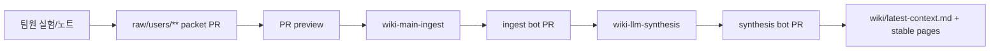

# 팀장 검토용 Wiki 구조 초안

이 문서는 Team LLM Wiki의 구조와 운영 정책을 확정하기 전에, 팀장 피드백을 받기 위한 검토 초안입니다.

목표는 세 가지입니다.

1. 현재 `./wiki`가 어떤 역할로 나뉘는지 한눈에 확인한다.
2. 팀장이 디렉토리별로 유지, 수정, 병합, 삭제 의견을 바로 적는다.
3. 최종 정책 확정 전 빠진 개념, 불편한 구조, 과한 자동화를 찾는다.

## 팀장 빠른 피드백

아래 항목을 먼저 체크해 주세요.

- [ ] 현재 구조를 대체로 유지해도 된다.
- [ ] 디렉토리 이름이나 분류를 일부 바꾸고 싶다.
- [ ] 너무 복잡하므로 줄여야 한다.
- [ ] packet skill이 물어보는 정보가 더 많아야 한다.
- [ ] ingest/synthesis bot PR을 더 엄격하게 봐야 한다.
- [ ] claim status 정책을 더 단순하게 해야 한다.
- [ ] 기타:

팀장 총평:

```text


```

## 한 줄 요약

`raw/`는 팀원이 올리는 원천 증거이고, `wiki/`는 LLM과 사람이 함께 유지하는 팀 지식층입니다.

팀원은 `wiki/`를 직접 편집하기보다 `raw/users/**` packet PR을 올립니다. 이후 자동화가 packet을 검증하고, GPT-5.5 synthesis가 기존 wiki와 연결해 stable page로 정리합니다.



팀장 메모:

```text


```

## 기본 정책

| 원칙 | 현재안 | 팀장 수정 의견 |
| --- | --- | --- |
| 원천 증거 | `raw/`는 append-only source of truth |  |
| 팀 지식 | `wiki/`는 packet 복붙이 아니라 stable entity 중심 정리 |  |
| 첫 진입점 | 새 AI 세션은 `wiki/latest-context.md` -> `wiki/index.md` 순서로 읽음 |  |
| 성능 claim | local OOF, notebook output, public LB, private LB, official validation을 분리 |  |
| claim status | `supported`, `tentative`, `disputed`, `superseded` 사용 |  |
| 자동화 | packet PR -> ingest bot PR -> synthesis bot PR 순서 |  |
| 리뷰 | 성능, 모델, 전처리, feature claim은 review-required |  |

팀장 메모:

```text


```

## Page 역할

현재 wiki page는 아래 역할 중 하나로 분류합니다.

| Page role | 의미 | 예시 | 팀장 의견 |
| --- | --- | --- | --- |
| `entrypoint` | AI와 사람이 먼저 읽는 시작점 | `latest-context.md`, `index.md`, `overview.md` |  |
| `registry` | claim, submission, benchmark 같은 목록 | `claims/current-supported-claims.md` |  |
| `hub` | 큰 주제의 요약과 leaf 연결 | `features/sleep-lifelog-feature-landscape.md` |  |
| `leaf` | 하나의 durable entity 기억 | `targets/q3-stress-bottleneck.md` |  |
| `packet_review` | 특정 raw packet의 검토 기록 | `performance/2026-06-12-*.md` |  |
| `report` | 특정 wave나 milestone 종합 | `reports/2026-06-12-*.md` |  |
| `policy` | 운영 규칙 | `team/wiki-ingest-policy.md` |  |

팀장 메모:

```text


```

## 현재 `./wiki` 구조

```text
wiki/
  latest-context.md
  index.md
  overview.md
  log.md
  benchmarks/
  briefs/
  claims/
  datasets/
  decisions/
  experiments/
  features/
  models/
  performance/
  preprocessing/
  questions/
  reports/
  sources/
  submissions/
  targets/
  team/
```

## 디렉토리별 검토

각 항목에서 팀장은 아래 네 가지 중 하나를 표시해 주세요.

- 유지: 현재 목적과 이름이 적절함
- 수정: 목적은 맞지만 이름, 필드, 운영 방식 수정 필요
- 병합: 다른 디렉토리와 합치는 편이 좋음
- 삭제: 현재 wiki에 필요 없음

### `wiki/latest-context.md`

현재 역할: 새 AI 세션이 가장 먼저 읽는 최신 팀 맥락입니다.

포함할 내용:

- 현재 가장 중요한 supported/tentative claim
- 최근 변화
- 지금 조심해야 할 leakage, claim boundary, open question
- 다음 작업자가 바로 봐야 할 링크

포함하지 않을 내용:

- 모든 packet history
- 긴 실험 로그
- raw evidence 전문

팀장 결정:

- [ ] 유지
- [ ] 수정
- [ ] 병합
- [ ] 삭제

팀장 메모:

```text


```

### `wiki/index.md`

현재 역할: wiki 전체 목차입니다.

주요 기준:

- entrypoint, stable pages, registry, report를 빠르게 찾게 한다.
- 자동 생성 구간과 사람이 정리하는 상단 구간이 함께 있다.

팀장 결정:

- [ ] 유지
- [ ] 수정
- [ ] 병합
- [ ] 삭제

팀장 메모:

```text


```

### `wiki/overview.md`

현재 역할: 프로젝트의 큰 방향과 현재 상태를 설명합니다.

주요 기준:

- 팀 전체 전략과 현황을 짧게 유지한다.
- 세부 실험은 각 hub/leaf/report로 링크한다.

팀장 결정:

- [ ] 유지
- [ ] 수정
- [ ] 병합
- [ ] 삭제

팀장 메모:

```text


```

### `wiki/log.md`

현재 역할: wiki 변경의 chronological audit trail입니다.

주요 기준:

- ingest, synthesis, 중요한 수동 정리 기록을 남긴다.
- 길어지는 것은 허용하지만, 최신 맥락 설명은 `latest-context.md`로 보낸다.

팀장 결정:

- [ ] 유지
- [ ] 수정
- [ ] 병합
- [ ] 삭제

팀장 메모:

```text


```

### `wiki/datasets/`

현재 역할: dataset 정의, modality, row/filter lineage, leakage risk를 정리합니다.

현재 예시:

- `sleep-lifelog-2024.md`

팀장에게 확인할 점:

- dataset page가 train/test split, subject id, target schema까지 포함해야 하는가?
- raw dataset 파일 경로와 schema mapping을 어느 수준까지 공개/기록할 것인가?

팀장 결정:

- [ ] 유지
- [ ] 수정
- [ ] 병합
- [ ] 삭제

팀장 메모:

```text


```

### `wiki/benchmarks/`

현재 역할: 평가 task, target taxonomy, metric, leaderboard 해석 기준을 정리합니다.

현재 예시:

- `sleep-health-hackathon-v0.md`

팀장에게 확인할 점:

- official split/metric이 공개되면 이 page가 canonical source가 되는가?
- public/private leaderboard와 local OOF의 병기 규칙을 어디까지 강제할 것인가?

팀장 결정:

- [ ] 유지
- [ ] 수정
- [ ] 병합
- [ ] 삭제

팀장 메모:

```text


```

### `wiki/preprocessing/`

현재 역할: split, leakage guard, normalization, aggregation window 같은 전처리 정책을 정리합니다.

현재 예시:

- `canonical-split-and-leakage-policy.md`
- `subject-hole-cv.md`

팀장에게 확인할 점:

- 전처리 정책은 실험별로 둘 것인가, canonical page에서 통제할 것인가?
- Subject-hole CV 같은 외부 reference split을 팀 내부 정책과 어떻게 구분할 것인가?

팀장 결정:

- [ ] 유지
- [ ] 수정
- [ ] 병합
- [ ] 삭제

팀장 메모:

```text


```

### `wiki/features/`

현재 역할: feature family, feature selection, SHAP/ablation 해석, adoption/rejection 정책을 정리합니다.

현재 예시:

- `sleep-lifelog-feature-landscape.md`
- `app-context-windows.md`
- `stability-filtered-feature-selection.md`

팀장에게 확인할 점:

- feature page는 feature 수식까지 포함해야 하는가?
- 중요 feature는 target별 page로 나눌 것인가, feature family별로 둘 것인가?

팀장 결정:

- [ ] 유지
- [ ] 수정
- [ ] 병합
- [ ] 삭제

팀장 메모:

```text


```

### `wiki/models/`

현재 역할: model family, ensemble 구조, objective, target별 전략, weights policy를 정리합니다.

현재 예시:

- `lightgbm-catboost.md`
- `v186-targetwise-lgbm-catboost.md`
- `lgbm-xgb-anchor-subject-hole-blend.md`

팀장에게 확인할 점:

- 모델 page에 hyperparameter까지 기록할 것인가?
- 모델 weight나 private code는 제외하되 구조 설명은 어디까지 허용할 것인가?

팀장 결정:

- [ ] 유지
- [ ] 수정
- [ ] 병합
- [ ] 삭제

팀장 메모:

```text


```

### `wiki/performance/`

현재 역할: 성능 claim, metric, raw evidence boundary, packet review를 정리합니다.

현재 예시:

- `2026-06-01-lgb-cb-reproduction-local-oof-diagnostic.md`
- `dacon-public-05917-lgbm-xgb-anchor-reference.md`

팀장에게 확인할 점:

- public LB 기록을 얼마나 적극적으로 추적할 것인가?
- local OOF와 public LB가 충돌할 때 어떤 값을 우선할 것인가?

팀장 결정:

- [ ] 유지
- [ ] 수정
- [ ] 병합
- [ ] 삭제

팀장 메모:

```text


```

### `wiki/claims/`

현재 역할: 현재 supported claim과 status를 관리하는 registry입니다.

현재 예시:

- `current-supported-claims.md`

팀장에게 확인할 점:

- `supported` claim의 최소 evidence 기준을 더 엄격히 할 것인가?
- 오래된 `tentative` claim을 자동으로 stale 처리할 것인가?

팀장 결정:

- [ ] 유지
- [ ] 수정
- [ ] 병합
- [ ] 삭제

팀장 메모:

```text


```

### `wiki/submissions/`

현재 역할: DACON leaderboard 제출/외부 public score/reference score를 분리해 기록합니다.

현재 예시:

- `dacon-leaderboard-history.md`

팀장에게 확인할 점:

- 제출 id, 파일 hash, 제출자, 제출일, public/private score를 필수로 할 것인가?
- 외부 code share score와 팀 제출 score를 같은 table에 둘 것인가, 분리할 것인가?

팀장 결정:

- [ ] 유지
- [ ] 수정
- [ ] 병합
- [ ] 삭제

팀장 메모:

```text


```

### `wiki/targets/`

현재 역할: Q3, S4 같은 target bottleneck과 target별 해석을 stable leaf로 관리합니다.

현재 예시:

- `q3-stress-bottleneck.md`
- `s4-waso-disturbance.md`

팀장에게 확인할 점:

- 모든 target마다 leaf page를 만들 것인가?
- target별 feature/model/performance를 이 page에 모을 것인가, 각 domain page로 나눌 것인가?

팀장 결정:

- [ ] 유지
- [ ] 수정
- [ ] 병합
- [ ] 삭제

팀장 메모:

```text


```

### `wiki/decisions/`

현재 역할: 팀의 중요한 결정, rejected alternative, rationale을 기록합니다.

현재 예시:

- `sleep-lifelog-evaluation-protocol.md`
- `section07-feature-policy-decision.md`

팀장에게 확인할 점:

- 결정 page를 formal ADR처럼 운영할 것인가?
- 누가 결정을 승인했는지 metadata를 남길 것인가?

팀장 결정:

- [ ] 유지
- [ ] 수정
- [ ] 병합
- [ ] 삭제

팀장 메모:

```text


```

### `wiki/questions/`

현재 역할: open question, evidence gap, close condition을 관리합니다.

현재 예시:

- `sleep-lifelog-open-questions.md`
- `section07-followup-backlog.md`

팀장에게 확인할 점:

- open question에 owner와 due date를 둘 것인가?
- 해결된 질문은 별도 archive로 옮길 것인가?

팀장 결정:

- [ ] 유지
- [ ] 수정
- [ ] 병합
- [ ] 삭제

팀장 메모:

```text


```

### `wiki/reports/`

현재 역할: 특정 wave, 날짜, milestone의 종합 보고서를 둡니다.

현재 예시:

- `2026-06-12-sleep-lifelog-packet-synthesis.md`
- `2026-06-02-team-packet-entity-coverage-audit.md`

팀장에게 확인할 점:

- 보고서를 매 synthesis마다 만들 것인가, 주요 milestone에서만 만들 것인가?
- 너무 많은 report가 생기면 weekly/monthly로 압축할 것인가?

팀장 결정:

- [ ] 유지
- [ ] 수정
- [ ] 병합
- [ ] 삭제

팀장 메모:

```text


```

### `wiki/experiments/`

현재 역할: 개별 실험 run 또는 작업 단위 기록을 둡니다.

현재 예시:

- `2026-05-29-labelwise-weekly-progress-target-bottlenecks.md`
- `2026-06-01-lifelog-section07-notebook-overview.md`

팀장에게 확인할 점:

- 실험 run page가 너무 많아지는 것을 허용할 것인가?
- 의미 있는 실험만 stable page로 남기고 나머지는 report로 압축할 것인가?

팀장 결정:

- [ ] 유지
- [ ] 수정
- [ ] 병합
- [ ] 삭제

팀장 메모:

```text


```

### `wiki/sources/`

현재 역할: 외부 reference, paper, code share, source summary를 둡니다.

현재 예시:

- `2026-06-01-dacon-leaderboard-claim-boundary.md`

팀장에게 확인할 점:

- 외부 논문과 DACON code share를 같은 sources에 둘 것인가?
- paper summary는 feature/model page로 바로 흡수할 것인가?

팀장 결정:

- [ ] 유지
- [ ] 수정
- [ ] 병합
- [ ] 삭제

팀장 메모:

```text


```

### `wiki/briefs/`

현재 역할: daily/weekly brief 생성 결과를 둘 수 있는 공간입니다.

현재 상태:

- 현재는 `.gitkeep`만 있습니다.

팀장에게 확인할 점:

- 자동 daily/weekly brief를 실제로 사용할 것인가?
- Slack/회의용 brief와 wiki report를 어떻게 분리할 것인가?

팀장 결정:

- [ ] 유지
- [ ] 수정
- [ ] 병합
- [ ] 삭제

팀장 메모:

```text


```

### `wiki/team/`

현재 역할: wiki 운영 정책, contribution workflow, packet quality, page taxonomy를 둡니다.

현재 예시:

- `llm-wiki-operating-harness.md`
- `wiki-ingest-policy.md`
- `contribution-workflow.md`
- `packet-quality-standard.md`
- `page-taxonomy.md`

팀장에게 확인할 점:

- 운영 정책을 이 repo 안에서 관리하는 것이 맞는가?
- 팀원 onboarding 문서와 agent용 정책 문서를 분리할 것인가?

팀장 결정:

- [ ] 유지
- [ ] 수정
- [ ] 병합
- [ ] 삭제

팀장 메모:

```text


```

## 팀장 추가 구조 제안

추가하고 싶은 디렉토리나 page가 있으면 적어 주세요.

| 제안 경로 | 목적 | 필요한 이유 |
| --- | --- | --- |
|  |  |  |
|  |  |  |
|  |  |  |

## 팀장 삭제/병합 제안

불필요하거나 합치고 싶은 디렉토리/page가 있으면 적어 주세요.

| 현재 경로 | 처리 | 이유 |
| --- | --- | --- |
|  |  |  |
|  |  |  |
|  |  |  |

## 확정 전 결정해야 할 질문

| 질문 | 현재 기본안 | 팀장 결정 |
| --- | --- | --- |
| `latest-context.md` 길이 제한 | 최신 맥락만 짧게 유지 |  |
| supported claim 기준 | raw evidence + metric validation 필요 |  |
| public LB claim 처리 | lineage 없으면 tentative |  |
| target별 page | 반복 등장하거나 bottleneck이면 leaf 생성 |  |
| experiment page 수 | 많아져도 허용하되 stable insight는 hub/leaf로 승격 |  |
| report 생성 주기 | synthesis마다 가능하되 중복되면 weekly로 압축 |  |
| open question 관리 | close condition 필수 |  |
| 팀장 승인 필요 범위 | governance-tier claim과 supported claim 승격 |  |

팀장 최종 결정:

```text


```

